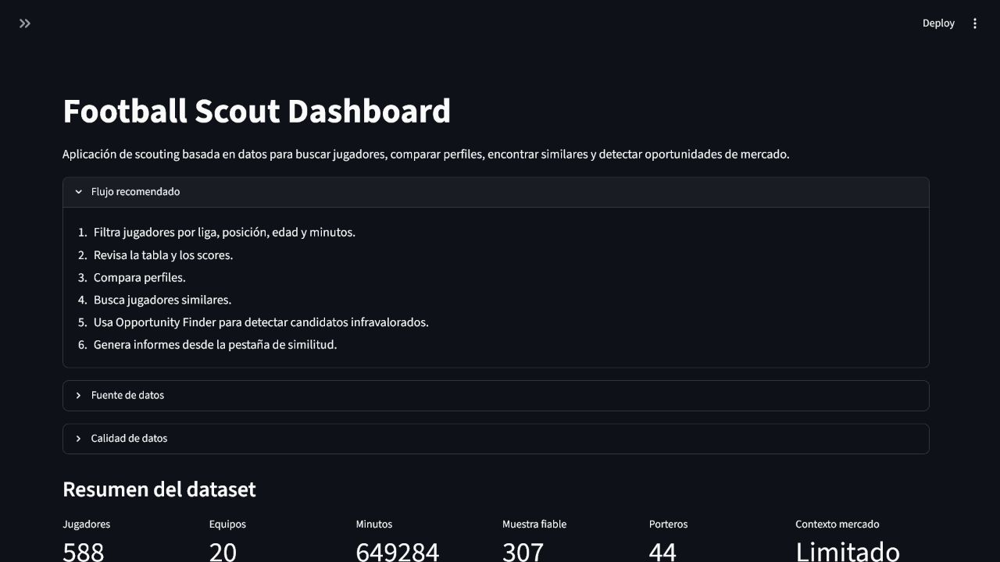
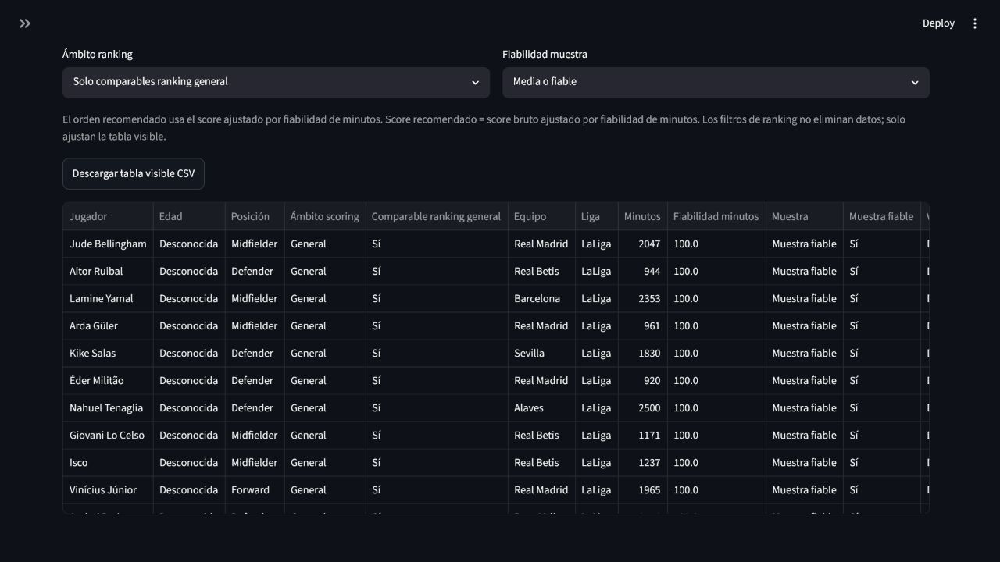
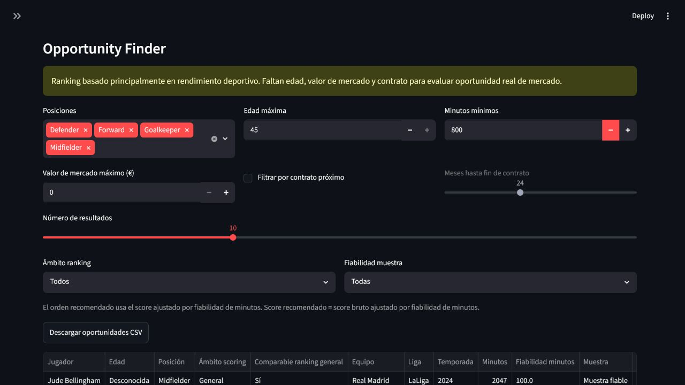
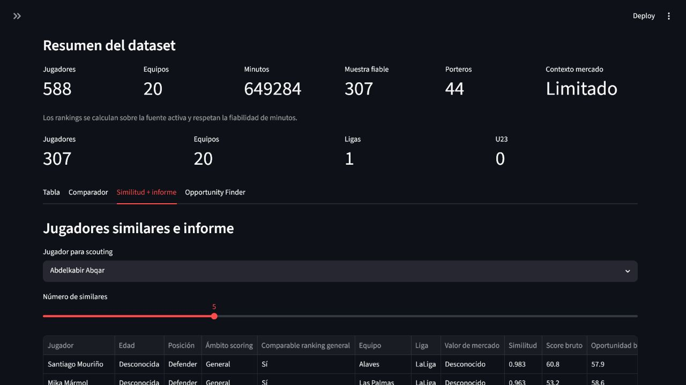

# Football Scout Dashboard

MVP de scouting futbolístico construido con Python, Streamlit, pandas, scikit-learn, Plotly y una arquitectura modular preparada para evolucionar a FastAPI + Next.js.

## Project highlights

- Local SQLite-first scouting dashboard.
- API-Football fixtures/players pipeline for local dataset refreshes.
- Sample-adjusted player rankings based on minutes reliability.
- Metrics without signal are ignored automatically by scoring.
- Goalkeeper comparability is handled separately from the general ranking.
- Opportunity Finder with reliability and comparability filters.
- CSV exports and HTML scouting reports.
- Market context enrichment template available in `data/enrichment/`.
- Optional market context CSV can be enabled through `FOOTBALL_SCOUT_MARKET_CONTEXT_CSV`.
- Real enrichment workflow supports local seed export, diagnostics and strict CSV validation.
- Tests cover scoring, ingestion, app helpers, diagnostics and data-source behavior.

## Demo workflow

1. Refresh the local dataset.
2. Open the Streamlit app.
3. Review the dataset summary.
4. Use player table filters.
5. Use Opportunity Finder.
6. Download a CSV shortlist.
7. Generate a scouting report.

A practical 5-10 minute demo script is available in [`docs/demo_walkthrough.md`](docs/demo_walkthrough.md).

## Screenshots

### Dataset summary



### Recommended ranking



### Opportunity Finder



### Similar players and report



## Release

Current milestone: `v0.9.0` provider suitability scope.

- Release notes: [`docs/release_notes_v0_1_0.md`](docs/release_notes_v0_1_0.md)
- v0.2.0 release notes: [`docs/release_notes_v0_2_0.md`](docs/release_notes_v0_2_0.md)
- v0.3.0 release notes: [`docs/release_notes_v0_3_0.md`](docs/release_notes_v0_3_0.md)
- v0.4.0 release notes: [`docs/release_notes_v0_4_0.md`](docs/release_notes_v0_4_0.md)
- v0.5.0 release notes: [`docs/release_notes_v0_5_0.md`](docs/release_notes_v0_5_0.md)
- v0.6.0 release notes: [`docs/release_notes_v0_6_0.md`](docs/release_notes_v0_6_0.md)
- v0.7.0 plan: [`docs/v0_7_0_permitted_provider_candidate_review_plan.md`](docs/v0_7_0_permitted_provider_candidate_review_plan.md)
- v0.7.0 release readiness: [`docs/v0_7_0_release_readiness.md`](docs/v0_7_0_release_readiness.md)
- v0.7.0 release notes: [`docs/release_notes_v0_7_0.md`](docs/release_notes_v0_7_0.md)
- v0.8.0 plan: [docs/v0_8_0_provider_permission_response_handling_plan.md](docs/v0_8_0_provider_permission_response_handling_plan.md)
- v0.8.0 release notes: [docs/release_notes_v0_8_0.md](docs/release_notes_v0_8_0.md)
- v0.9.0 scope plan: [docs/v0_9_0_provider_suitability_scope_plan.md](docs/v0_9_0_provider_suitability_scope_plan.md)
- Demo assets checklist: [`docs/demo_assets_checklist.md`](docs/demo_assets_checklist.md)

v0.8.0 is completed and published. Sportmonks remains unapproved; v0.9.0 will decide whether to continue with Sportmonks, compare providers or stop provider exploration.

## v0.2.0 Market Context Layer

v0.2.0 adds an opt-in Market Context Layer for manually reviewed enrichment CSVs. It validates schema, merges context by player/team/league/season, shows enrichment and effective coverage in the app, and lets Opportunity Finder use effective age, market value and contract date when valid values exist.

Enable a CSV explicitly with:

```powershell
$env:FOOTBALL_SCOUT_MARKET_CONTEXT_CSV="data/enrichment/player_market_context_sample.csv"
```

The bundled sample is identity-only and does not contain real market values, ages or contract dates. Details are documented in [`docs/market_context_plan.md`](docs/market_context_plan.md).

## v0.3.0 Real Enrichment Workflow

v0.3.0 adds a local workflow for manually reviewed market context enrichment. It can export a seed CSV from Opportunity Finder, validate reviewed values, diagnose coverage, and display effective market context in Opportunity Finder.

Generate a local seed:

```powershell
.venv\Scripts\python.exe scripts\export_enrichment_seed.py --top-n 25
```

Diagnose a reviewed local CSV:

```powershell
.venv\Scripts\python.exe scripts\diagnose_market_context.py --market-context-csv data\enrichment\player_market_context_laliga_2024_reviewed.local.csv
```

Activate it explicitly:

```powershell
$env:FOOTBALL_SCOUT_MARKET_CONTEXT_CSV="data/enrichment/player_market_context_laliga_2024_reviewed.local.csv"
```

Reviewed CSVs should stay local by default and are ignored by git when named as `.local.csv` or `*_reviewed.csv`. See [`docs/release_notes_v0_3_0.md`](docs/release_notes_v0_3_0.md) and [`docs/v0_3_0_plan.md`](docs/v0_3_0_plan.md).

## v0.4.0 Provider Workflow

Provider evaluation and canonical Market Context output review are documented in [`docs/provider_workflow_quickstart.md`](docs/provider_workflow_quickstart.md). The workflow keeps provider data local, avoids scraping and requires preview, validation and diagnostics before app activation.

Release notes: [`docs/release_notes_v0_4_0.md`](docs/release_notes_v0_4_0.md).

## v0.5.0 Provider Fixture Prototype

v0.5.0 adds an offline synthetic fixture prototype that applies reviewed provider identity mappings, builds canonical Market Context and validates the generated output without network calls or real provider data. See [`docs/v0_5_0_provider_fixture_prototype_plan.md`](docs/v0_5_0_provider_fixture_prototype_plan.md), [`docs/provider_identity_mapping_plan.md`](docs/provider_identity_mapping_plan.md) and the [`v0.5.0 release notes`](docs/release_notes_v0_5_0.md).

## v0.6.0 Licensed Provider Payload Evaluation

v0.6.0 adds payload evaluation governance, an advanced synthetic payload shape, a pure flattening helper, a local-only CLI and an end-to-end synthetic demo toward canonical Market Context. It does not add a real provider or activate provider data in the app.

See the [release notes](docs/release_notes_v0_6_0.md), [payload shape notes](docs/provider_payload_shape_notes.md) and [provider payload evaluation checklist](docs/provider_payload_evaluation_checklist.md).

## v0.7.0 Permitted Provider Candidate Review

v0.7.0 was published as a documentation and governance milestone for reviewing a specifically permitted provider candidate. It does not imply a real integration, an approved provider or an approved real payload.

See the [`v0.7.0 plan`](docs/v0_7_0_permitted_provider_candidate_review_plan.md), [`initial shortlist`](docs/provider_candidates/v0_7_0_initial_shortlist.md), [`shortlist matrix`](docs/v0_7_0_provider_candidate_shortlist_matrix.md), operational [`candidate review workflow`](docs/v0_7_0_candidate_review_workflow.md) and [`candidate review pack template`](docs/v0_7_0_candidate_review_pack_template.md).

## Funcionalidades

- Carga de CSV y uso de `data/sample_players.csv` por defecto.
- Normalización de columnas en español/ingles.
- Limpieza automática y validación de columnas obligatorias.
- Métricas por 90 minutos.
- Percentiles por posicion.
- Scores propios: finalización, creación, progresión, defensa y overall.
- Market Opportunity Score para detectar jugadores infravalorados.
- Opportunity Finder para rankear candidatos según edad, minutos, mercado y contrato.
- Métricas de similitud especificas por posición.
- Tabla filtrable.
- Comparador entre jugadores.
- Radar charts con Plotly.
- Jugadores similares mediante cosine similarity.
- Informes automáticos de scouting en HTML.

## Estructura

```text
football-scout-dashboard/
  app.py
  requirements.txt
  README.md
  data/
    sample_players.csv
  reports/
    generated/
  templates/
    scouting_report.html
  assets/
  notebooks/
  src/
    __init__.py
    config.py
    schema.py
    data_cleaning.py
    features.py
    scoring.py
    similarity.py
    opportunity.py
    visualizations.py
    reports.py
  tests/
    test_data_cleaning.py
    test_features.py
    test_similarity.py
    test_scoring.py
    test_reports.py
    test_opportunity.py
```

## Instalación

```bash
python -m venv .venv
.venv\Scripts\activate
pip install -r requirements.txt
```

## Ejecutar

```bash
streamlit run app.py
```

## CSV esperado

Columnas canónicas recomendadas:

```text
player, age, position, team, league, minutes, goals, assists, xg, xa,
shots, key_passes, progressive_passes, progressive_carries,
completed_dribbles, duels_won, recoveries, interceptions,
season, market_value, contract_end
```

También se aceptan aliases comunes en español, por ejemplo `Jugador`, `Edad`, `Posicion`, `Equipo`, `Liga`, `Minutos`, `Goles`, `Asistencias`, `Tiros`, `Pases clave`, `Pases progresivos`, `Conducciones progresivas`, `Regates completados`, `Duelos ganados`, `Recuperaciones` e `Intercepciones`.

## Data sources

La fuente principal prevista es SQLite, usando por defecto `data/football_scout.db` y la tabla `players`.

El proveedor externo es opcional y se activa configurando `EXTERNAL_PROVIDER_URL`. Esta capa solo prepara el punto de integración: no incluye scraping, credenciales reales ni llamadas obligatorias a servicios externos.

El CSV `data/sample_players.csv` queda como fallback y dataset de demo si SQLite o el proveedor externo no devuelven datos.

El upload manual de CSV en Streamlit sigue disponible y tiene prioridad sobre la carga por defecto.

La app muestra en la interfaz la fuente activa de datos para distinguir entre SQLite, proveedor externo, CSV fallback o upload manual.

La decisión técnica sobre proveedores de datos está documentada en [`docs/data_provider_decision.md`](docs/data_provider_decision.md).

## How to use the dashboard

La guia de uso esta en [`docs/user_guide.md`](docs/user_guide.md). Resume el flujo recomendado para revisar el dataset, interpretar rankings, usar Opportunity Finder, tratar porteros por separado y descargar shortlists en CSV.

La metodologia de scoring esta documentada en [`docs/scoring_methodology.md`](docs/scoring_methodology.md).

## Scoring methodology

El ranking recomendado usa scores ajustados por fiabilidad de minutos. Las metricas sin senal real se ignoran automaticamente, y los porteros tienen un tratamiento separado porque no son plenamente comparables con el ranking general.

La metodologia completa de scoring, Opportunity Finder, fiabilidad por minutos y limitaciones del dataset actual esta documentada en [`docs/scoring_methodology.md`](docs/scoring_methodology.md).

## SQLite local ingestion

Genera la base local SQLite desde el CSV de ejemplo con:

```bash
.venv\Scripts\python.exe scripts/load_sample_to_sqlite.py
```

El script carga `data/sample_players.csv` en `data/football_scout.db`, tabla `players`. Después de ejecutarlo, la app cargará SQLite como fuente principal por defecto. Si la base no existe, la capa de datos cae al CSV de demo.

## External provider ingestion

La app permite preparar una ingesta desde `EXTERNAL_PROVIDER_URL` hacia SQLite. El proveedor debe devolver JSON como lista de jugadores o como objeto con clave `players`.

`EXTERNAL_PROVIDER_URL` define de dónde cargar datos. `EXTERNAL_PROVIDER_NAME` define cómo normalizarlos. Valores disponibles: `generic` y `api_football`.

`.env.example` es solo una plantilla. El proyecto actualmente no carga archivos `.env` automáticamente, así que define las variables en la sesión antes de ejecutar la ingesta.

Ejemplo en PowerShell:

```powershell
$env:EXTERNAL_PROVIDER_URL="https://example.com/players.json"
$env:EXTERNAL_PROVIDER_NAME="api_football"
.venv\Scripts\python.exe scripts/load_external_to_sqlite.py
```

El script carga los datos en `data/football_scout.db`, tabla `players`. Todavía no hay proveedor específico implementado, credenciales reales ni scraping.

## External normalization

Los datos externos se normalizan al esquema interno antes de guardarse en SQLite. Existe soporte genérico para registros planos con aliases comunes y un primer adaptador preparado para estructuras tipo API-Football.

Todavía no hay conexión real a un proveedor específico, credenciales ni scraping. Esta capa solo prepara la transformación de payloads externos hacia columnas canónicas como `player`, `team`, `league`, `minutes`, `goals`, `assists` y métricas relacionadas.

## API-Football client

Existe un cliente HTTP mínimo preparado para API-Football / API-Sports. Usa `API_FOOTBALL_KEY`, `API_FOOTBALL_BASE_URL` y `API_FOOTBALL_TIMEOUT_SECONDS`, pero todavía no está conectado a la ingesta real ni incluye credenciales.

## Manual API-Football raw fetch

El script manual permite inspeccionar payloads reales de API-Football antes de normalizar o conectar la ingesta. Requiere `API_FOOTBALL_KEY` definida en la sesión y guarda por defecto en `data/raw/api_football_players_raw.json`.

`data/raw/` está ignorado por git para evitar versionar respuestas crudas del proveedor.

Ejemplo en PowerShell:

```powershell
$env:API_FOOTBALL_KEY="tu_clave"
.venv\Scripts\python.exe scripts/fetch_api_football_players_raw.py --league-id 140 --season 2024 --page 1
```

Para probar una consulta más concreta por equipo:

```powershell
.venv\Scripts\python.exe scripts/fetch_api_football_players_raw.py --league-id 140 --season 2024 --team-id 541 --page 1 --output data/raw/api_football_laliga_real_madrid_2024.json
```

## Inspect API-Football raw payload

Después de guardar un payload con `fetch_api_football_players_raw.py`, puedes inspeccionar su estructura y revisar un mapping de muestra hacia el esquema canónico antes de normalizar o ingestar datos reales.

```powershell
.venv\Scripts\python.exe scripts/inspect_api_football_payload.py --input data/raw/api_football_players_raw.json
```

## Generic API-Football endpoint fetch

El fetch genérico sirve para investigar endpoints de API-Football antes de implementar ingesta. Usa `--endpoint` y parámetros repetibles `--param key=value`, requiere `API_FOOTBALL_KEY` en la sesión y guarda JSON bruto en `data/raw/`.

```powershell
.venv\Scripts\python.exe scripts/fetch_api_football_raw_endpoint.py --endpoint players --param league=140 --param season=2024 --param team=541 --output data/raw/api_football_players_real_madrid.json
```

Ejemplo para probar squads:

```powershell
.venv\Scripts\python.exe scripts/fetch_api_football_raw_endpoint.py --endpoint players/squads --param team=541 --output data/raw/api_football_squads_real_madrid.json
```

## Inspect API-Football fixture players payload

Los payloads de `fixtures/players` pueden inspeccionarse y aplanarse antes de decidir el mapping hacia SQLite.

```powershell
.venv\Scripts\python.exe scripts/inspect_api_football_fixture_players_payload.py --input data/raw/api_football_fixture_players_1208494.json --limit 20
```

## Fetch API-Football fixture player payloads in batch

Descarga payloads `fixtures/players` a partir de un JSON local del endpoint `fixtures`, usando caché local y un límite máximo por ejecución. Este paso solo guarda JSON bruto en `data/raw/fixture_players`; no agrega, no normaliza y no carga SQLite.

Dry-run para revisar qué fixtures descargaría sin llamar a la API:

```powershell
.venv\Scripts\python.exe scripts/fetch_api_football_fixture_players_batch.py --fixtures data/raw/api_football_laliga_2024_finished_fixtures.json --output-dir data/raw/fixture_players --limit 5 --dry-run
```

Ejecución real limitada:

```powershell
.venv\Scripts\python.exe scripts/fetch_api_football_fixture_players_batch.py --fixtures data/raw/api_football_laliga_2024_finished_fixtures.json --output-dir data/raw/fixture_players --limit 5
```

Para tandas reales, usa límites pequeños y un delay entre requests:

```powershell
.venv\Scripts\python.exe scripts/fetch_api_football_fixture_players_batch.py --fixtures data/raw/api_football_laliga_2024_finished_fixtures.json --output-dir data/raw/fixture_players --limit 5 --delay-seconds 2
```

Usa `--force` para sobrescribir archivos ya cacheados, `--continue-on-error` para continuar ante errores no relacionados con rate limit y `--status FT --status AET --status PEN` para filtrar por estado si el JSON de fixtures contiene más partidos. Si aparece un error `429 Too Many Requests`, espera antes de continuar; el script lo marca como rate limit y se detiene para evitar seguir golpeando la API.

## Aggregate API-Football fixture players

Los payloads locales de `fixtures/players` pueden agregarse offline por jugador/equipo antes de conectar SQLite.

```powershell
.venv\Scripts\python.exe scripts/aggregate_api_football_fixture_players.py --input data/raw/api_football_fixture_players_1208494.json --input data/raw/api_football_fixture_players_real_madrid_sample.json --output data/raw/api_football_fixture_players_aggregated_sample.json
```

## Normalize API-Football aggregated players

El JSON agregado offline puede convertirse a filas compatibles con el schema de la app. Este paso todavía no carga SQLite y no inventa edad, contrato ni valor de mercado.

```powershell
.venv\Scripts\python.exe scripts/normalize_api_football_aggregated_players.py --input data/raw/api_football_fixture_players_aggregated_sample.json --output data/raw/api_football_players_canonical_sample.json
```

## Load API-Football canonical players to SQLite

El JSON canónico de API-Football puede cargarse en SQLite reemplazando la tabla `players`. Los archivos `data/raw/` y `data/football_scout.db` siguen ignorados por git.

```powershell
.venv\Scripts\python.exe scripts/load_api_football_canonical_to_sqlite.py --input data/raw/api_football_players_canonical_sample.json
```

## Build SQLite from local API-Football fixture player files

Pipeline local/offline para tomar JSON locales de `fixtures/players`, agregarlos por jugador/equipo, normalizarlos al schema canónico y reemplazar la tabla SQLite en un solo comando. No hace llamadas a internet y permite completar `league` y `season` cuando el payload no trae ese contexto.

```powershell
.venv\Scripts\python.exe scripts/build_api_football_sqlite_from_fixture_players.py --input data/raw/api_football_fixture_players_1208494.json --input data/raw/api_football_fixture_players_real_madrid_sample.json --league LaLiga --season 2024 --canonical-output data/raw/api_football_players_canonical_sample.json
```

También se puede usar `--input-glob "data/raw/api_football_fixture_players_*.json"` y guardar el agregado intermedio con `--aggregated-output`.

## Show local dataset status

Resume el estado local del dataset sin llamar a internet ni modificar SQLite: fixtures totales, payloads `fixtures/players` cacheados, pendientes y cobertura básica de la tabla `players`.

```powershell
.venv\Scripts\python.exe scripts/show_local_dataset_status.py --fixtures data/raw/api_football_laliga_2024_finished_fixtures.json --fixture-players-dir data/raw/fixture_players --league LaLiga --season 2024
```

## Refresh local dataset

Orquesta el flujo local completo: opcionalmente descarga fixtures pendientes, reconstruye SQLite desde los JSON cacheados y muestra el estado final.

Solo reconstruir SQLite y mostrar estado:

```powershell
.venv\Scripts\python.exe scripts/refresh_local_dataset.py --fixtures data/raw/api_football_laliga_2024_finished_fixtures.json --fixture-players-dir data/raw/fixture_players --league LaLiga --season 2024
```

Fetch pequeño, rebuild y status:

```powershell
.venv\Scripts\python.exe scripts/refresh_local_dataset.py --fixtures data/raw/api_football_laliga_2024_finished_fixtures.json --fixture-players-dir data/raw/fixture_players --league LaLiga --season 2024 --limit 5 --delay-seconds 2
```

Dry-run sin llamadas API ni rebuild:

```powershell
.venv\Scripts\python.exe scripts/refresh_local_dataset.py --fixtures data/raw/api_football_laliga_2024_finished_fixtures.json --fixture-players-dir data/raw/fixture_players --league LaLiga --season 2024 --limit 5 --dry-run
```

## Demo use case

This MVP helps identify undervalued football players through statistical filters, position-based percentiles, similarity modelling and automated scouting reports.

Example:
Find U23 wingers with high dribbling volume, strong chance creation, good ball progression metrics and accessible market value.

The app returns:

- filtered player rankings;
- Market Opportunity Score;
- radar charts;
- similar players;
- automated scouting reports.

Suggested demo flow:

1. Open the app and use the default sample dataset.
2. Filter positions to `LW` and `RW`.
3. Set the age range to U23.
4. Sort by `market_opportunity_score`.
5. Compare the best candidate against a more established player.
6. Review the radar chart and similar players.
7. Generate the HTML scouting report.

## Flujo recomendado

1. Filtra jugadores por liga, posición, edad y minutos.
2. Revisa la tabla y los scores.
3. Compara perfiles.
4. Busca jugadores similares.
5. Usa Opportunity Finder para detectar candidatos infravalorados.
6. Genera informes desde la pestaña de similitud.

## Opportunity Finder

Opportunity Finder ayuda a convertir el `market_opportunity_score` en un ranking accionable de scouting. Permite buscar jugadores jóvenes, con minutos suficientes, valor de mercado acotado y, opcionalmente, contrato próximo a finalizar.

Problema que resuelve: reduce una tabla amplia de estadísticas a una lista corta de candidatos potencialmente infravalorados.

Ejemplo:
Buscar extremos sub-23 con alto impacto ofensivo, buen regate, valor de mercado bajo y contrato próximo a finalizar.

## Tests

```bash
pytest
```

Los tests cubren la parte reusable del dominio. `app.py` se mantiene como una capa fina de UI para facilitar una futura migración a FastAPI + Next.js.
